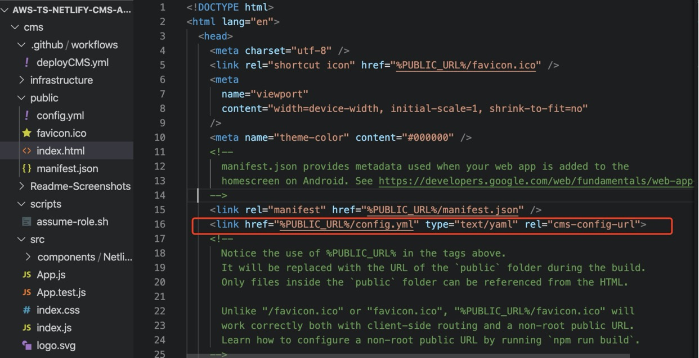
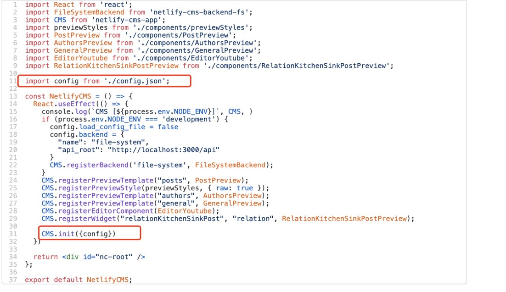
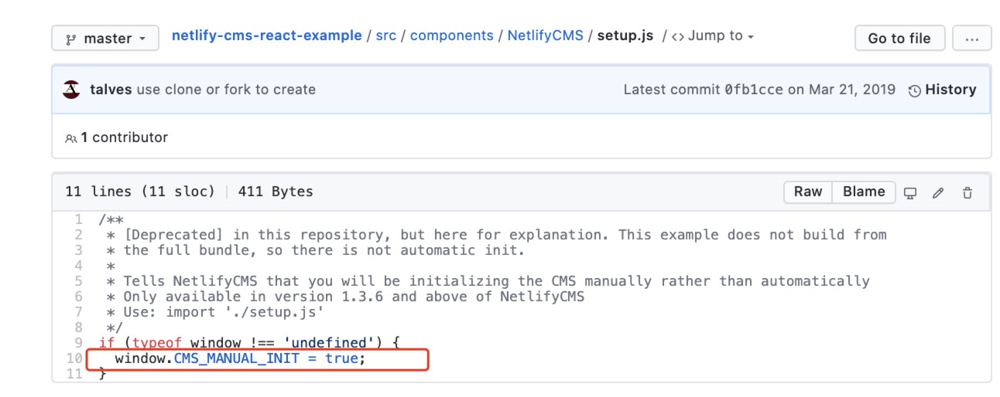
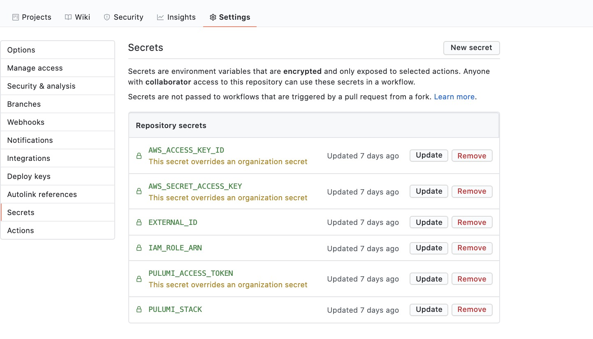

[Netlify CMS ](https://www.netlifycms.org/docs/intro/) is an open-source content management system that provides UI for editing content and adopting Git workflow. Initially, we want to take advantage of it to increase efficiency to edit Pulumi's website. However, during development, we found few examples are deploying the CMS application on AWS instead of Netlify, its home platform. Therefore, in this blog post, we would like to share the way to organize Netlify's file structure and use Pulumi to store the content on S3 buckets, connect to CloudFront, and configure certificate in Certificate Manager. 

[Note**: Because we are deploying CMS on AWS, we could not use Netlify's Identity Service, which handles access token send by Github API. For the alternatives, we will introduce the way to write the [External OAuth Client Server](https://www.netlifycms.org/docs/external-oauth-clients/) and deploy it on AWS in the next post.]


<!--more-->


For environment details, we are using [Nelify CMS's Github backend](https://www.netlifycms.org/docs/github-backend/). Our CMS app is changing website content stored in another Github repository under the same account. The website is using Hugo as the static site generator.

## Separating CMS Into a Stand-alone React App
The [starter template](https://www.netlifycms.org/docs/start-with-a-template/) provided by Netlify CMS has the CMS application implemented inside the target repository. To improve the modularity, we have separated the CMS application from the target repository and implement it in another repository under the same Github account.

We used the [templates from @talves](https://github.com/ADARTA/netlify-cms-react-example) to separate the CMS as a simple stand-alone React application.

### CMS Configuration File

The `config.yml` is the configuration for Netlify CMS to look for which content segments that need to be edited and which backend instructions that it needs to follow.

Inside the template, `cms/public/index.html` is the key HTML that contains the entry point for React to insert the generated content under `<div id=root>`. We could change the title of the website to what we want. But more importantly, we linked the configuration file `cms/public/config.yml` of the Netlify CMS following the [instructurion](https://www.netlifycms.org/docs/configuration-options/). 



The template uses the JSON configuration file config.json, puts this under `./src/components/NetlifyCMS/config.json`, and sets [CMS Manual Init](https://www.netlifycms.org/docs/beta-features/#manual-initialization) in file `./src/components/NetlifyCMS/setup.js` and file `./src/components/NetlifyCMS/index.js`.




However, by specify the link to config.yml file in the index.html and put config.yml under the public folder, we reduce the step to set the CMS manual to init step, which is confusing to beginners. Also, we can have a YAML config file similar to the provided example from Netlify CMS. 

###  Let CMS Points to Another Repository

The template only separates the CMS as a stand-alone React app but CMS still lies inside the target repository. It turns out we could change the value field `repo:` in the `backend:` field of the `config.yml` file to point to the specific repository we would like CMS to change. 


### File Structure

Simplify the file and delete unnecessaries would produce this:


`./src/index.js` is the entry point for React to create App inside `./public/index.html`'s  `<div id=root>`. The `App` class (defined in `./src/App.js`) is a React Component that would return the `NetlifyCMS` React component defined inside the `./src/components/NetlifyCMS/index.js`. The `./src/components/NetlifyCMS/index.js` file is also the file we could specify the [custom preview](https://www.netlifycms.org/docs/customization/#registerpreviewtemplate) and [custom widget](https://www.netlifycms.org/docs/custom-widgets/#header) for the CMS app.

Then run `yarn start` will bring out the server that we could preview the CMS app content.

Now that we have preprocessed the file structure. Let's deploy the CMS onto the AWS!

## Implement Infrastructure

First of all, we should create an `infrastructure` folder to store the Pulumi Program. Then, as usual, we will generate a new Pulumi project by running command `pulumi new typescript` to generate a typescript template. 

Because the CMS app itself is a React web app, we can use the same code as [Pulumi's deploying static website example](https://github.com/pulumi/examples/tree/master/aws-ts-static-website). The static website example with other cloud and other languages are also available inside the [Pulumi's example repositories](https://github.com/pulumi/examples)

### Step 1: Build the CMS App

Before introducing the Pulumi code, we need to build the website by `yarn build`. This will create a `build` folder under the root directory, which is the React compiled version of the website contents that we should upload to S3 bucket. In this way, S3 would contain a working version of our CMS app and reduce the number of the unnecessary file to upload.

### Step 2: Fetch Configuration

The first step is to replace the parameter of pulumi.Config source with our stack name to fetch the configuration of our stack.

```typescript
// Replace "pulumi-website-cms" with your stack name
const stackConfig = new pulumi.Config("pulumi-website-cms");
const config = {
    pathToWebsiteContents: stackConfig.require("pathToWebsiteContents"),
    targetDomain: stackConfig.require("targetDomain"),
    certificateArn: stackConfig.get("certificateArn"),
};
```

The configuration takes three parameters. We could set them using Pulumi CLI

```bash
$ pulumi config set pulumi-website-cms:pathToWebsiteContent ../build
```
pathToWebsiteContent would specify the path to the folder that stores the website content, so it could crawl the directory by using the `crawlDirectory` method and sync the S3 bucket with the content. In the case of CMS, we should pass in the build folder under the root directory, which is the directory that stores our built CMS website.

Similarly, we could set the CMS's target domain name and the optional certificate arn parameter ( which needs `stackConfig.get` instead of `stackConfig.require` to get the value). For the target domain, we could come up with any subdomain name of an existing parent domain. The code would create the subdomain under the parent domain automatically. For certificate arn, if we already have a certificate registered for CMS then we could pass in as certificate arn. Otherwise, the code would generate a new certificate.

```bash
# subdomain name: some-cms-domain and parent domain is pulumi-demos.com which is an existing one.
$ pulumi config set pulumi-website-cms:targetDomain https://some-cms-domain.pulumi-demos.com
# replace the value of certificateArn with the correct one
$ pulumi config set pulumi-website-cms:certificateArn arnarnarnxxx
```
Also, don't forget to set the region of AWS to be us-east-1. It couldn't be a different value because the ACM certificate has to be in this region.

```bash
$ pulumi config set aws:region us-east-1
```

### Step 3: Bucket Creation

We created the S3 bucket by using these code. Because of our builded CMS app does not contain a `404.html` error documment we comment out the errorDocument configuration,

```typescript
// contentBucket is the S3 bucket that the website's contents will be stored in.
const contentBucket = new aws.s3.Bucket("contentBucket",
    {
        bucket: config.targetDomain,
        acl: "public-read",
        // Configure S3 to serve bucket contents as a website. This way S3 will automatically convert
        // requests for "foo/" to "foo/index.html".
        website: {
            indexDocument: "index.html",
            // errorDocument: "404.html",
        },
    });
```
Then we crawl the content directory and for every file in the `../build` directory we passed in, we are creating content files as a form of bucket objects and place it under the parent bucket we created. In this way, we filled the bucket up with the content inside of the `../build` folder. 

```typescript
function crawlDirectory(dir: string, f: (_: string) => void) {
    const files = fs.readdirSync(dir);
    for (const file of files) {
        const filePath = `${dir}/${file}`;
        const stat = fs.statSync(filePath);
        if (stat.isDirectory()) {
            crawlDirectory(filePath, f);
        }
        if (stat.isFile()) {
            f(filePath);
        }
    }
}

// Sync the contents of the source directory with the S3 bucket, which will in-turn show up on the CDN.
const webContentsRootPath = path.join(process.cwd(), config.pathToWebsiteContents);
console.log("Syncing contents from local disk at", webContentsRootPath);
crawlDirectory(
    webContentsRootPath,
    (filePath: string) => {
        const relativeFilePath = filePath.replace(webContentsRootPath + "/", "");
        const contentFile = new aws.s3.BucketObject(
            relativeFilePath,
            {
                key: relativeFilePath,

                acl: "public-read",
                bucket: contentBucket,
                contentType: mime.getType(filePath) || undefined,
                source: new pulumi.asset.FileAsset(filePath),
            },
            {
                parent: contentBucket,
            });
    });
```
We also created the private CDN request log bucket just for development needs.

```typescript
// logsBucket is an S3 bucket that will contain the CDN's request logs.
const logsBucket = new aws.s3.Bucket("requestLogs",
    {
        bucket: `${config.targetDomain}-logs`,
        acl: "private",
    });
```

###  Step 4: Certificate Creation and Validation

If the certificateArn is not provided as a configuration, the code will create a new certificate.

Therefore, the first step is to create an east region, which is the required region for ACM Certificate.

Then we will create a new certificate by doing:

```typescript
const certificate = new aws.acm.Certificate("certificate", {
        domainName: config.targetDomain,
        validationMethod: "DNS",
    }, { provider: eastRegion });
```

Then create a Route53 Record to prove we own the domain that we are requesting the certificate for.

```typescript
const domainParts = getDomainAndSubdomain(config.targetDomain);
const hostedZoneId = aws.route53.getZone({ name: domainParts.parentDomain }, { async: true }).then(zone => zone.zoneId);

/**
    *  Create a DNS record to prove that we _own_ the domain we're requesting a certificate for.
    *  See https://docs.aws.amazon.com/acm/latest/userguide/gs-acm-validate-dns.html for more info.
    */
const certificateValidationDomain = new aws.route53.Record(`${config.targetDomain}-validation`, {
    name: certificate.domainValidationOptions[0].resourceRecordName,
    zoneId: hostedZoneId,
    type: certificate.domainValidationOptions[0].resourceRecordType,
    records: [certificate.domainValidationOptions[0].resourceRecordValue],
    ttl: tenMinutes,
});
```
`getDomainAndSubdomain` is a method for separating the parent domain and child domain. For our example  `https://some-cms-domain.pulumi-demos.com` the parent domain would be pulumi-demos.com and the subdomain is some-cms-domain. 


Then we would validate the certificate by setting the CertificateValidation resource. After that, we will use the certificateArn of the checked certificate.

```typescript
/**
     * This is a _special_ resource that waits for ACM to complete validation via the DNS record
     * checking for a status of "ISSUED" on the certificate itself. No actual resources are
     * created (or updated or deleted).
     *
     * See https://www.terraform.io/docs/providers/aws/r/acm_certificate_validation.html for slightly more detail
     * and https://github.com/terraform-providers/terraform-provider-aws/blob/master/aws/resource_aws_acm_certificate_validation.go
     * for the actual implementation.
     */
    const certificateValidation = new aws.acm.CertificateValidation("certificateValidation", {
        certificateArn: certificate.arn,
        validationRecordFqdns: [certificateValidationDomain.fqdn],
    }, { provider: eastRegion });

    certificateArn = certificateValidation.certificateArn;
```
### Configure the CloudFront distribution

We will create a distributionArgs for the CloudFront:

```typescript
// distributionArgs configures the CloudFront distribution. Relevant documentation:
// https://docs.aws.amazon.com/AmazonCloudFront/latest/DeveloperGuide/distribution-web-values-specify.html
// https://www.terraform.io/docs/providers/aws/r/cloudfront_distribution.html
const distributionArgs: aws.cloudfront.DistributionArgs = {
    enabled: true,
    // Alternate aliases the CloudFront distribution can be reached at, in addition to https://xxxx.cloudfront.net.
    // Required if you want to access the distribution via config.targetDomain as well.
    aliases: [ config.targetDomain ],

    // We only specify one origin for this distribution, the S3 content bucket.
    origins: [
        {
            originId: contentBucket.arn,
            domainName: contentBucket.websiteEndpoint,
            customOriginConfig: {
                // Amazon S3 doesn't support HTTPS connections when using an S3 bucket configured as a website endpoint.
                // https://docs.aws.amazon.com/AmazonCloudFront/latest/DeveloperGuide/distribution-web-values-specify.html#DownloadDistValuesOriginProtocolPolicy
                originProtocolPolicy: "http-only",
                httpPort: 80,
                httpsPort: 443,
                originSslProtocols: ["TLSv1.2"],
            },
        },
    ],

    defaultRootObject: "index.html",

    // A CloudFront distribution can configure different cache behaviors based on the request path.
    // Here we just specify a single, default cache behavior which is just read-only requests to S3.
    defaultCacheBehavior: {
        targetOriginId: contentBucket.arn,

        viewerProtocolPolicy: "redirect-to-https",
        allowedMethods: ["GET", "HEAD", "OPTIONS"],
        cachedMethods: ["GET", "HEAD", "OPTIONS"],

        forwardedValues: {
            cookies: { forward: "none" },
            queryString: false,
        },

        minTtl: 0,
        defaultTtl: tenMinutes,
        maxTtl: tenMinutes,
    },

    // "All" is the most broad distribution, and also the most expensive.
    // "100" is the least broad, and also the least expensive.
    priceClass: "PriceClass_100",

    // You can customize error responses. When CloudFront receives an error from the origin (e.g. S3 or some other
    // web service) it can return a different error code, and return the response for a different resource.
    // customErrorResponses: [
    //     { errorCode: 404, responseCode: 404, responsePagePath: "/404.html" },
    // ],

    restrictions: {
        geoRestriction: {
            restrictionType: "none",
        },
    },

    viewerCertificate: {
        acmCertificateArn: certificateArn,  // Per AWS, ACM certificate must be in the us-east-1 region.
        sslSupportMethod: "sni-only",
    },

    loggingConfig: {
        bucket: logsBucket.bucketDomainName,
        includeCookies: false,
        prefix: `${config.targetDomain}/`,
    },
};

const cdn = new aws.cloudfront.Distribution("cdn", distributionArgs);
```

### Step 5: Alias Record
Then, we can create an alias record that points to the CloudFront distribution that we configured. Here is the function for it.

```typescript
function createAliasRecord(
    targetDomain: string, distribution: aws.cloudfront.Distribution): aws.route53.Record {
    const domainParts = getDomainAndSubdomain(targetDomain);
    const hostedZoneId = aws.route53.getZone({ name: domainParts.parentDomain }, { async: true }).then(zone => zone.zoneId);
    return new aws.route53.Record(
        targetDomain,
        {
            name: domainParts.subdomain,
            zoneId: hostedZoneId,
            type: "A",
            aliases: [
                {
                    name: distribution.domainName,
                    zoneId: distribution.hostedZoneId,
                    evaluateTargetHealth: true,
                },
            ],
        });
}

const aRecord = createAliasRecord(config.targetDomain, cdn);
```
---

Now that we have finished implementing the infrastructure of deploying. After setting the AWS configuration we could run `pulumi up` to execute the Pulumi code to deploy this on AWS. However, there is a more convenient way to do so.

## Github Workflow (Optional)

Github Workflow adopts the Continuous Delivery/Integration concept and specifies a series of steps to run and deploy the program. We could take advantage of it with our CMS.

Under the `.github/workflow` we have implemented the workflow that we described above. The sixth step "Assume Role" is for people who had an AWS IAM user access token and want to assume the role of admin in one of AWS account, then the code in `./scripts/assume-role.sh` contains a great function to assume a role in the AWS account.

In the workflow, multiple Github Secret are referred to as `${{ secrets.ACCESS_TOKEN }}` where `ACCESS_TOKEN` is any Github secret. We could specify the secret inside the project setting of Github. 



`AWS_ACCESS_KEY_ID` and `AWS_SECRET_ACCESS_KEY` is the IAM user tokens. `IAM_ROLE_ARN` and `EXTERNAL_ID` is the information for the role that we would like to assume. `PULUMI_ACCESS_TOKEN` is required for the automatic process and could be generated by clicking the blue button "New Access Token" on the Settings of https://app.pulumi.com


---

## Summary and Next Step

Now we have deployed the stand-alone React CMS application on AWS. The full code is included in [Pulumi's Example Repository](https://github.com/pulumi/examples) with the link [TODO: FILL IN THE LINK]

As mentioned previously, because we are deploying on AWS instead of Netlify, we have to found a way to substitute the Netlify Identity Service. Thus, the next step is to write an External OAuth Client-Server and deploy it on AWS as well. We would introduce that in our next blog post.


